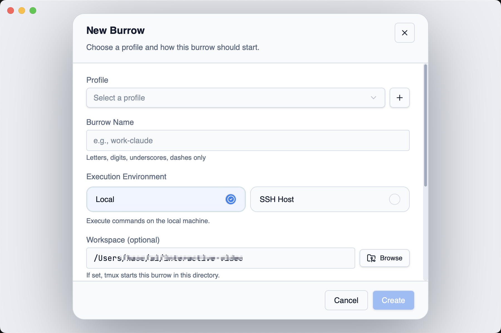
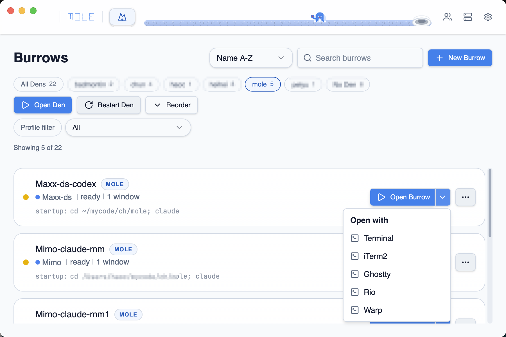

# Burrows 配置指南

Burrow 是 Mole 的核心概念——一个带名字的终端会话。每个 Burrow 选择一种运行模式，绑定一个 Profile（环境变量），可选分配到一个 Den（窗口分组）。

## 运行模式总览

| 模式 | 适用场景 | 需要的配置 |
|------|---------|-----------|
| Shell | 本地开发、日常终端 | Profile（可选） |
| SSH Host | 连接远程服务器 | Host + Profile（可选） |
| Command | 执行固定命令（如 `claude`、`python main.py`） | Profile + 命令 |
| Codex | OpenAI Codex CLI 独立环境 | Codex Config + Profile |
| Docker | 进入容器 shell | Docker Config + Profile（可选） |
| K8s Pod | kubectl exec 进入 Pod | Plugin Preset + Profile（可选） |
| Tmux Attach | 接入本地已有 tmux 会话 | Plugin Preset + Profile（可选） |
| Remote Tmux | 跨 SSH 接入远程已有 tmux 会话 | Plugin Preset + Profile（可选） |
| Script | 运行已保存的命令/脚本预设 | Script Config + Profile（可选） |

Shell、SSH Host、Command 是内置模式，直接在新建 Burrow 时配置。其余模式需要先在对应的配置页面（如 Settings 中的 Plugins / Codex / Docker / Scripts）创建对应的配置或预设，然后在新建 Burrow 时引用。

## 创建 Burrow

1. 点击 **New Burrow** 按钮
2. 填写以下字段：

| 字段 | 说明 |
|------|------|
| Name | Burrow 名称，会显示在列表中 |
| Profile | 选择环境配置，决定启动时注入哪些环境变量 |
| Run Mode | 选择运行模式（见上表） |
| Workspace | 工作目录，tmux 会在此目录下启动 |
| Den | 可选，分配到某个 Den 以实现窗口分组 |

3. 根据所选运行模式，会出现对应的配置面板：

### Shell 模式
最简单的模式——直接打开一个带 Profile 环境变量的终端。无需额外配置。

### SSH Host 模式
从 Hosts 列表中选择一个已保存的主机，Mole 自动生成 SSH 命令（含堡垒机跳转）。

### Command 模式
输入要执行的命令，如 `claude`、`vim`、`python main.py`。命令会在 Profile 环境下启动。

### Codex 模式
选择一个 Codex Config（在 Settings > Codex 中创建），Mole 会用独立的 `CODEX_HOME` 目录启动 Codex CLI。

### Docker 模式
选择一个 Docker Config（在 Settings > Docker 中创建），指定镜像，Mole 生成 `docker run` 命令并进入容器 shell。

### K8s Pod / Tmux 模式
这些模式需要选择一个预先创建的 **Plugin Preset**（在 Settings > Plugins 中管理）。

### Script 模式
选择一个预先创建的 **Script Config**（在 Settings > Scripts 中管理），Mole 会自动获取该脚本的最新命令并执行。

## Launch Preview

创建前可以看到 Mole 将要执行的完整命令预览，确认无误后再保存。

## 会话生命周期

| 操作 | 说明 |
|------|------|
| Open | 连接到活跃的 tmux 会话 |
| Restore | 重建已断开但配置仍保存的会话 |
| Restart | 用原配置重新创建会话 |
| Detach | 断开终端视图，tmux 会话保持后台运行 |
| Destroy | 终止会话并从存储中删除 |
| Remove | 从列表中移除离线会话 |

## Open with — 指定终端

每个 Burrow 可以单独选择用哪个终端打开，覆盖 Settings 中的默认终端。点击 **Open with** 下拉选择即可。