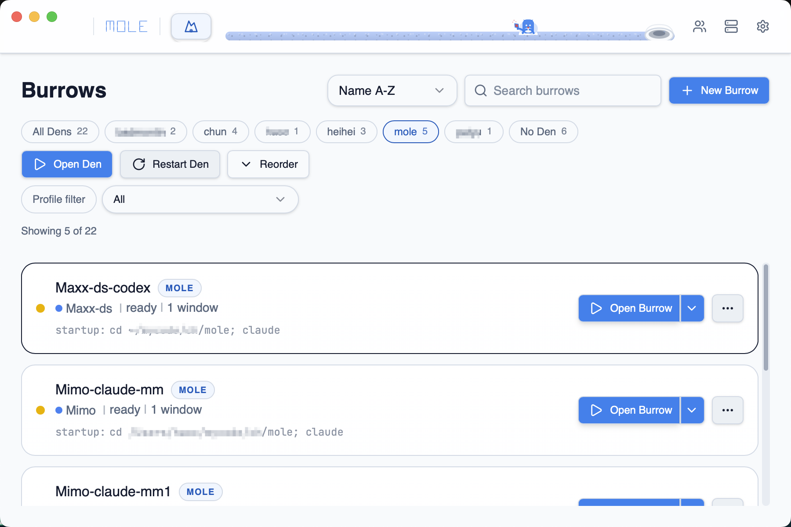
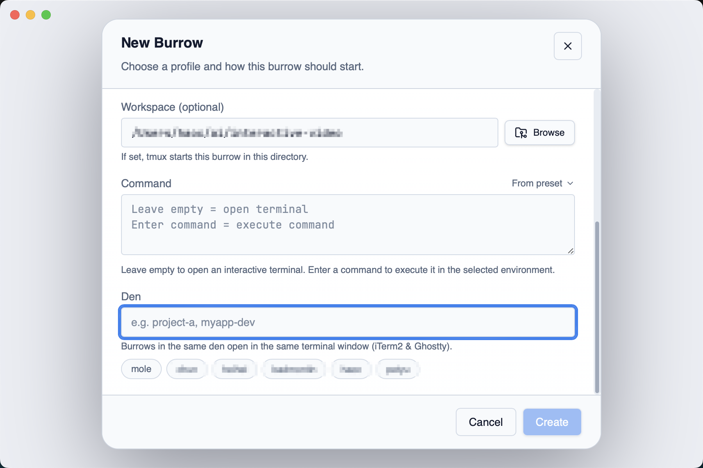

# Dens 配置指南

Den（巢）是 Mole 的窗口分组机制——同一个 Den 下的 Burrow 会打开在同一终端窗口内，而不是各自独立窗口。

## 分组效果

| 终端 | 分组方式 |
|------|---------|
| iTerm2 | 同 Den 的 Burrow 打开在同一窗口的不同 Tab，窗口标题为 `Mole: <den-name>` |
| Ghostty | 同 Den 的 Burrow 打开在同一个窗口（通过 `--window-id=mole-<den-name>`） |
| 其他终端 | 每个 Burrow 独立窗口（不支持分组） |

## 创建和分配 Den

1. 创建或编辑 Burrow 时，在 **Den** 字段中输入 Den 名称
2. 新 Den 名称会自动创建，无需额外操作
3. 已存在的 Den 名称会出现在下拉列表中，直接选择即可

> Den 名称是自由文本，不需要预先创建。只要两个 Burrow 的 Den 名称相同，它们就属于同一个 Den。

## Open Den

点击 Den 名称旁的 **Open Den** 按钮，Mole 会依次打开该 Den 下所有 Burrow：
- 已活跃的 Burrow 跳过（不重复创建）
- 离线的 Burrow 自动 Restore
- 开启顺序按 Den 内排列顺序

## Restart Den

点击 **Restart Den**，该 Den 下所有 Burrow 都会被重建，适合一次性刷新整个开发环境。

## Reorder Den

拖拽 Burrow 卡片调整顺序，决定 Open Den 时各 Burrow 的启动顺序和终端 Tab 排列顺序。