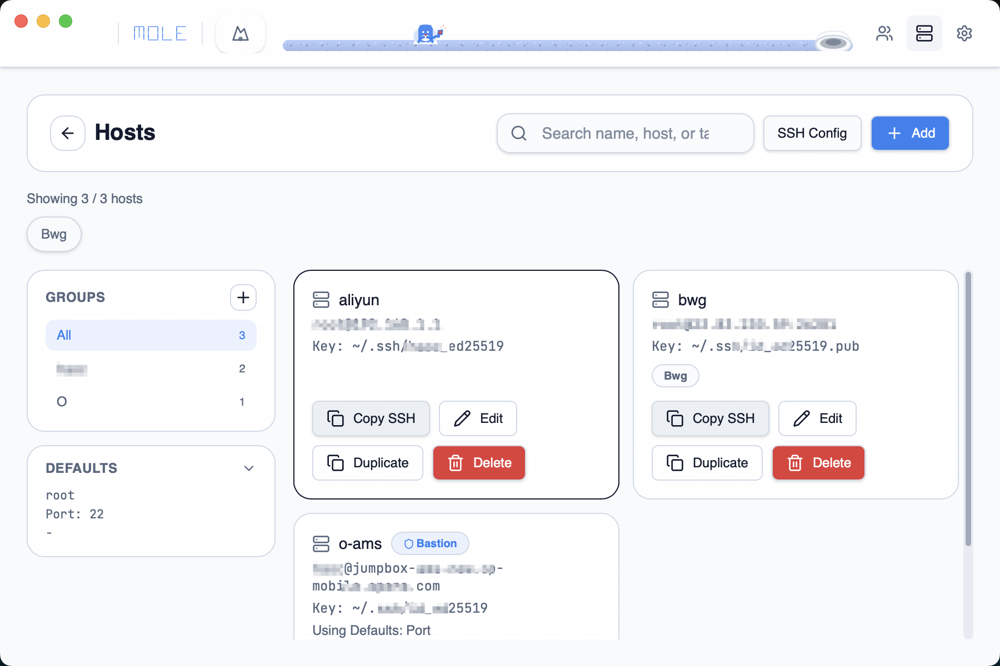
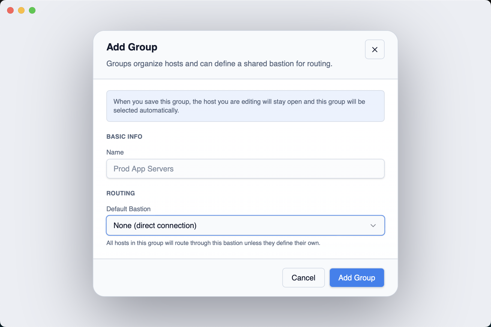

# Hosts 配置指南

Hosts 是 SSH 主机库存，配合 Burrow 的 SSH Host 模式使用。保存主机信息后，创建 Burrow 时直接选择 Host，Mole 自动生成完整的 SSH 命令。

## 创建 Host



1. 进入 **Hosts** 页面，点击 **New Host**
2. 填写以下字段：

| 字段 | 说明 |
|------|------|
| Name | Host 显示名称 |
| Address | 主机地址（IP 或域名） |
| User | SSH 用户名 |
| Port | SSH 端口，默认 22 |
| Identity File | SSH 密钥文件路径 |
| Tags | 自由标签，用于搜索和分类 |
| Bastion / Jump Host | 可选，指定堡垒机（见下文） |

## Host Groups



Group 用来组织多个 Host，并可以为 Group 设置共享属性：

1. 在 **Hosts** 页面点击 **New Group**
2. 填写 Group 名称和描述
3. 将 Host 分配到 Group
4. 可设置 Group 级默认堡垒机（见下文）

Group 内的 Host 可以共享：
- 默认堡垒机（组成员自动继承）
- 其他 Group 级设置

## 堡垒机 / JumpHost

### Host 级堡垒机

在单个 Host 编辑界面中指定 **Bastion / Jump Host**，Mole 生成 SSH 命令时会添加 `-J bastion-user@bastion-address` 参数：

```bash
ssh -J jump@bastion.example.com user@target.example.com
```

### Group 级堡垒机

在 Group 设置中指定默认堡垒机，所有组成员自动继承该跳板配置。如果某个 Host 已单独设置了堡垒机，则 Host 级设置优先。

### 多跳链路

从 `~/.ssh/config` 导入的 Host 可能携带多跳 Jump Chain（如 `ProxyJump bastion1,bastion2`），Mole 会完整保留并在生成命令时使用。

## SSH Config 导入


1. 点击 **Import from SSH Config**
2. Mole 解析 `~/.ssh/config`，列出所有可导入的 Host 别名
3. 选择要导入的 Host，确认后自动创建对应的 Host 记录
4. 如果与已有 Host 冲突，可选择跳过或覆盖

## Host Defaults

在 Hosts 页面设置全局默认值（默认 User、Port、Identity File），新建 Host 时未填写的字段会自动使用默认值。

## 复制 SSH 命令

每个 Host 卡片上有 **Copy SSH Command** 按钮，一键复制完整的 SSH 命令到剪贴板（含堡垒机参数），方便在其他场景直接使用。